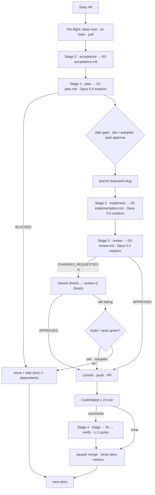

Run the Elmanhg feature pipeline for: **$ARGUMENTS**

You are the **orchestrator**. You route, gate, record, and report. You never plan, implement, review, or triage yourself — every stage is a fresh subagent. Writing code yourself defeats the pipeline.

## Unit of work

- One **story** issue (label `story`) = one plan = one branch = one PR = one squash merge.
- The story's `### Sub-tasks` checklist is the scope. All of it is planned and built in that one run.
- `--board` runs every open story in the order below, one after another, without stopping.

**Board order** (dependencies first): E1, E2, E3, E4, E5, E6, E10, E7, E8, E9, E11, E12, E13, E14, E15, E16, E17. Within an epic, `S1, S2, …`. The story's key is in its title: `[E3.S2] …`.

## Models

| Stage | Agent | Model |
|---|---|---|
| Orchestrate, git, gates, merge | this session | session model |
| 1 · Plan | `feature-planner` | Opus 5.5, effort medium |
| 2 · Implement, rework, CodeRabbit fix | `feature-implementer` (fresh each time) | Opus 5.5, effort medium |
| 3 · Review, CodeRabbit triage, verify | `feature-reviewer` (fresh each time) | Opus 5.5, effort medium |

Model and effort come from each agent's frontmatter. Never let one subagent do two stages. Never continue a reviewer that watched its findings get fixed — always launch a fresh one.

## Modes

- **Attended** (default): the plan gate and the round-2 stop wait for the dev.
- **Autopilot**: active when the dev's instruction in this session says so (e.g. "run everything without interruption"). Record that instruction verbatim in every story's `00-acceptance.md`. In autopilot every gate below uses its **autopilot rule**; nothing waits for a human.



## Pre-flight (every story)

1. `git status --porcelain` must be empty; `git switch main && git pull --ff-only`.
   - Attended: dirty tree → stop and show the files.
   - Autopilot: a dirty tree left by a crashed previous story → stash it with the message `autopilot-leftover-<story>`, record it in the final report, continue.
2. Git must never prompt: the repo-local credential helper pins github.com to the `gh` token of `MohamedEbrahimMohsen`. If a git command asks for credentials, stop the run and report — do not click through anything.
3. Skip stories that are closed, and stories whose dependency story was skipped (record why).

## Stage 0 — Acceptance

Create `.process/<N>-<slug>/` (`slug` = kebab-case of the title without the `[Ex.Sy]` key). Write:
- `00-acceptance.md` — date, story number and title, the dev's acceptance reply verbatim (autopilot: the dev's session instruction verbatim, plus "auto-accepted under autopilot").
- `00-story.md` — the issue title and body verbatim (`gh issue view <N> --json title,body`).
- `04-metrics.md` — the run-log header (see Metrics).

## Stage 1 — Plan

Launch `feature-planner` with: the story number, the paths to `00-story.md`, the slug, and the instruction to write `.process/<N>-<slug>/01-plan.md`.

- `BLOCKED` → open a GitHub issue (label `blocked`, body = the planner's BLOCKED section, link to the story), comment on the story, skip it and its dependants.
- **Gate.** Attended: show Goal, Scope, Decisions, Files to create; wait for approval. Autopilot: auto-approve, append `Plan gate: auto-approved (autopilot) <timestamp>` to `00-acceptance.md`.
- Every item the plan puts under **Deferred** becomes a GitHub issue (label `deferred`, linked to the story) after the story merges.

## Stage 2 — Implement

1. `git switch -c feature/<N>-<slug>` from an up-to-date `main`.
2. Launch `feature-implementer` with the path to `01-plan.md` and the slug (the path, not the contents). It writes `02-implementation.md`.
3. Postman: `postman/elmanhg.postman_collection.json` mirrors the API surface in the same change.

## Stage 3 — Review

Launch a fresh `feature-reviewer` with the paths to `01-plan.md` and `02-implementation.md`. It writes `03-review.md`, first line `VERDICT: …`.

- **APPROVED** → Stage 4.
- **CHANGES_REQUESTED, round 1** → fresh `feature-implementer` in rework mode with `03-review.md`, then a fresh `feature-reviewer` → `03-review-r2.md`.
- **CHANGES_REQUESTED, round 2** → no round 3.
  - Attended: stop and hand the open findings to the dev.
  - Autopilot: run the build and tests yourself (`dotnet build api/ && dotnet test api/`, `npm --prefix web run build && npm --prefix web test -- --run`, `python -m pytest ai/` for the touched stacks).
    - Green → proceed to Stage 4, and after merge open one issue (label `review-debt`) listing every still-open finding verbatim.
    - Red → do not merge. Push the branch, open the PR as draft, open an issue (label `failed`) with the failing output and the findings, skip the story and its dependants.

## Stage 4 — PR, CodeRabbit, merge

1. **Commit & PR.** Stage everything (code + `.process/<N>-<slug>/`), commit `feat(<epic-key>): <story title>` with the attribution trailer, push, `gh pr create --base main` with body: the plan's Goal, `Closes #<N>`, links to the `.process` artifacts, the attribution line.
2. **CodeRabbit.** Poll the PR's reviews and comments (`gh api repos/{owner}/{repo}/pulls/<pr>/comments`, `/reviews`, `/issues/<pr>/comments`) every 60 s for up to 15 minutes, ignoring CodeRabbit's summary/walkthrough comment. Save actionable comments verbatim to `05-coderabbit-comments.md`, numbered RC1….
   - Nothing actionable within 15 min → `05-coderabbit-comments.md` says so; go to merge.
   - Autopilot: if the **first** PR of the run gets no CodeRabbit activity at all (not even a summary), stop polling on later PRs, and open one issue (`coderabbit-not-reviewing`).
3. **Triage** — fresh `feature-reviewer` in triage mode: verify each claim in the code, classify Critical (must fix) / Major / Minor (fix or reject with rationale; the constitution and style guides outrank CodeRabbit's generic preferences) / DEV-DECISION. Writes `06-coderabbit-triage.md`, first line `TRIAGE: N to implement, M rejected, K dev-decisions`. Autopilot: DEV-DECISION items become issues (label `dev-decision`).
4. **Fix** — fresh `feature-implementer` scoped to exactly the IMPLEMENT items → `07-coderabbit-rework.md`. **Verify** — fresh `feature-reviewer` → `08-coderabbit-verify.md`. Commit, push. New actionable comments → repeat once (`-r2`). Cap: 2 cycles; leftovers become one `review-debt` issue.
5. **Merge.** `gh pr merge <pr> --squash --delete-branch`. If merge is refused (conflict with main), rebase the branch on main, re-run build + tests, push, retry once; still refused → issue (`failed`) and skip. After merge: `git switch main && git pull --ff-only`, confirm the story issue closed, tick its checklist items, create the `deferred` issues.

## Metrics — `.process/<N>-<slug>/04-metrics.md`

```markdown
| # | Stage | Agent | Model | Started | Finished | Duration | Tokens | Tool uses | Outcome |
|---|-------|-------|-------|---------|----------|----------|--------|-----------|---------|
```

One row per stage, appended as it completes, from the subagent's reported usage. `n/a` when the session does not surface a number; never estimate. Close with a summary block: review rounds, CodeRabbit cycles, total tokens, wall time, verdict, PR link.

## Board report (autopilot, after the last story)

Write `docs/implementation-report.md`:
- One row per story: status (merged / merged-with-debt / skipped / failed / blocked), PR, review rounds, CodeRabbit N fixed / M rejected, issues opened.
- Every issue opened during the run, grouped by label.
- Fakes still standing in for real providers (Paymob, SMS, Claude API, transcription, hosting) and what is needed to switch each to real.
- How to run the system locally (commands that were actually verified).
Commit it through a normal PR and merge it.

## Rules

- Never skip pre-flight, a stage, or the review, even for a one-line change.
- Never implement on `main`.
- Never edit an approved `.process/` artifact; write the next one.
- Never force-push, never `reset --hard`, never delete a remote branch other than the story's own merged branch.
- A skipped or failed story is always a GitHub issue. Nothing fails silently.
