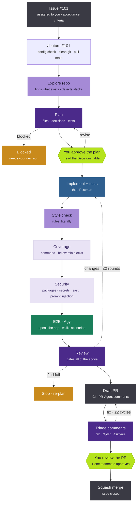
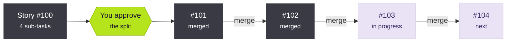
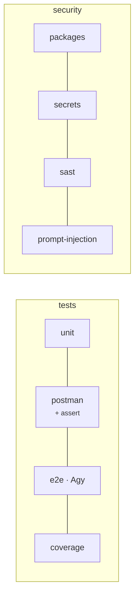

# Feature Pipeline Guide

How to install `/feature` and ship a task with it. Ten minutes to install, one command to run. You approve three times; the agents do the rest.

**Contents:** [What it is](#1-what-it-is) · [Install](#2-install--10-minutes) · [Configure the repo](#3-configure-the-repo--5-minutes-once) · [Run a task](#4-run-a-task) · [The 3 gates](#5-the-three-gates) · [Stories](#6-stories-and-sub-tasks) · [Frontend](#7-frontend-tasks-two-things-must-exist) · [Tests & security](#8-tests-and-security-you-decide-per-stack-and-per-task) · [Where things are](#9-where-things-are) · [When it stops](#10-when-it-stops) · [Rules](#11-rules-that-never-change) · [Updating](#12-updating)

---

## 1. What it is

You give it a GitHub issue number. It plans, writes the code and tests, reviews itself, opens a PR, handles PR-Agent comments, and hands you a PR that is ready for human review. It stops and waits for you at three points. It never merges.



| Colour | Who |
|---|---|
| 🟢 lime | you decide |
| 🟣 purple | Opus 5.5 · thinks |
| 🟪 lavender | Sonnet · reads & lists |
| 🔵 blue | implementer · writes code (OpenCode by default) |
| 🟩 green | Agy (Antigravity) · clicks through the running app |
| ⬜ pale | a command, no model |
| ⬛ dark | GitHub |
| 🟠 orange | loop / stop |

---

## 2. Install · 10 minutes

1. **Get the package.** Unzip `feature-pipeline.zip` anywhere, e.g. `D:\tools\feature-pipeline`. Keep it; you re-run it for updates.

2. **Open a terminal in your repo** and run the installer.

   PowerShell (Windows):
   ```powershell
   D:\tools\feature-pipeline\install.ps1
   ```
   Git Bash / macOS / Linux:
   ```bash
   /d/tools/feature-pipeline/install.sh
   ```

3. **Pick the project role** when asked. It decides which stacks the repo gets.

   | # | Role | Stacks |
   |---|---|---|
   | 1 | backend | dotnet |
   | 2 | frontend | react |
   | 3 | fullstack | dotnet + react |
   | 4 | mobile-flutter | flutter |
   | 5 | mobile-kmp | kmp |
   | 6 | ai | python + node + react (AI tools + POC web app) |
   | 7 | custom | type the stacks: dotnet · react · node · flutter · kmp · python · python-flask · python-django |

4. **Done.** Two folders now exist:

   ```
   ~/.claude/            ← your machine · the engine · same for every repo · never edit
   ├── commands/feature.md
   ├── agents/            9 agents
   ├── skills/            team skills the agents read
   └── templates/

   <repo>/.claude/       ← the repo · committed · this is what you edit
   ├── pipeline.yml       THE config
   ├── skills/<stack>-feature/SKILL.md
   ├── conventions/<stack>-testing.md
   ├── design-system.md   UI repos only
   └── README.md
   ```

> **Already have things in `~/.claude`?** Nothing is deleted. If a file with the same name exists and differs, the installer lists it and asks: overwrite · keep yours · abort. Your own commands and skills are untouched.

---

## 3. Configure the repo · 5 minutes, once

Open `.claude/pipeline.yml`. Every stack has the same shape. Check the numbered lines; everything else can wait.

```yaml
stacks:
  dotnet:
    root:    api/                # ① where the code lives · solution at repo root → .
    build:   dotnet build api/    # ② the real build command
    test:    dotnet test api/     # ③ the real test command
    tests:
      unit:     { on: true }
      postman:  { on: true, assert: true, collection: postman/myapp.postman_collection.json }   # ④ your collection
      e2e:      { on: false, start: "dotnet run --project api/", url: http://localhost:5000/swagger }
      coverage: { on: false, cmd: ..., min: 80 }
    security:
      packages:         { on: true,  cmd: "dotnet list api/ package --vulnerable --include-transitive" }
      secrets:          { on: true,  cmd: "gitleaks detect --no-git -s api/" }
      sast:             { on: false, cmd: "semgrep --config auto --error api/" }
      prompt-injection: { on: false }

agy:
  model: "Gemini 3.8 Flash (High)"                                   # ⑤ the E2E model

github:
  base: main                      # ⑥ the branch PRs go to
```

Switch on what the stack needs with `on: true`, switch off what it doesn't. The same keys exist in every stack, so anything one stack can do, every stack can.

Then run `/feature` with no arguments once. It checks every path and command and prints exactly what is wrong, if anything.

### Optional: use your own Claude subscription for the implementer

Team default writes code with OpenCode (cheap). If your plan allows Opus for that too, copy `.claude/pipeline.local.example.yml` → `.claude/pipeline.local.yml`. It is gitignored; only your runs change.

---

## 4. Run a task

Only tasks assigned to you. Pass the issue number or link. The agent never picks work from the board.

```
claude
/feature #101
```

What you see, in order:

| Step | Who | You do |
|---|---|---|
| Config + git check | — | nothing, unless it prints a fix |
| Explore repo, detect stacks | Sonnet | nothing |
| Plan | Opus | nothing |
| **Plan gate** | **you** | read the Decisions table, approve or revise |
| Implement + tests → Postman → style → coverage → security → E2E → review (≤2 rounds) | impl · Sonnet · Opus · Agy | nothing |
| Draft PR · CI · PR-Agent · triage · fix (≤2 cycles) | GitHub · Opus · impl | nothing, unless asked a product question |
| **PR ready** | **you** | review the PR on GitHub, get one teammate's approval, squash merge |

> **Closed the terminal at a gate?** Run `/feature #101` again. It continues from where it stopped.

---

## 5. The three gates

These are the only moments the pipeline waits for a human. Answer clearly; "yes", "approve", "revise: …" all work.

| Gate | When | What you see / do |
|---|---|---|
| **Split gate** | stories only | The proposed sub-tasks in order, with a reason each. Edit, reorder, drop, or approve. Approved sub-tasks become GitHub sub-issues assigned to you. |
| **Plan gate** | every task | Detected stacks, the full Decisions table, files to create, and the test switches for this run. This is where you catch a wrong assumption. Read the Decisions, not just the Goal. |
| **PR gate** | every task | The PR is marked ready. You review it like any PR. One teammate approves. You merge. The agent is not involved. |

Example plan gate:

```
Plan for #101 — Add refund endpoint
Stacks: dotnet — because the issue names an endpoint and an error code

Decisions
| # | Question               | Decision              | Why                        |
| 1 | refund after 30 days?  | reject, ORDER_TOO_OLD | policy doc §4              |
| 2 | partial refunds?       | out of scope          | not in acceptance criteria |

dotnet  tests: unit ON · postman ON (assert ON) · e2e OFF · coverage OFF
        security: packages ON · secrets ON · sast OFF · prompt-injection OFF
Approve / revise?
```
```
> approve
```

---

## 6. Stories and sub-tasks

Give it the story number. It proposes sub-tasks (or checks the ones already there), you approve, then it runs them **one at a time, in order**. Each sub-task is one branch and one PR.



One branch · one PR · one review each. The next one starts only after merge.

After each PR: merge it, then run `/feature #100` again. It tells you "next up: #103 (3 of 4)" and continues. It never starts the next sub-task before the previous one is merged.

> **Rule: one PR per sub-task, never per function.** A big task is a big PR. That is fine. Small PRs come from small tasks, not from cutting one task into pieces.

---

## 7. Frontend tasks: two things must exist

| Must exist | Detail |
|---|---|
| **Design system** | `.claude/design-system.md` with the tokens (colours, type, spacing, components). Owned by the UI/UX team. Missing → the run stops before planning. |
| **Figma frames** | When asked, paste the Figma link(s) for the task's screens. If the repo has no Figma MCP, export the frames as PNG into `.process/<task>/figma/`. No frames → stop. |

Every visual value in the code must be a token from the design system. A raw `#hex` or `13px` is a blocking finding. Every state the frame shows (loading, empty, error) must exist in code.

---

## 8. Tests and security: you decide, per stack and per task

Defaults come from `pipeline.yml`, per stack. At the plan gate you can override for this task only ("no unit tests, it's a POC", "run e2e this time").



| Block | Switch | What it does | Default |
|---|---|---|---|
| tests | unit | writes the plan's tests, updates or deletes existing tests the change breaks | on |
| tests | postman | API stacks: a request per added / changed / removed endpoint · `assert: true` = each request checks its status and error code ("input X → error Y" is a passing scenario) | on for API stacks |
| tests | e2e | starts the app, Agy opens it in a browser and walks the plan's E2E scenarios, one screenshot each | off |
| tests | coverage | runs the coverage command, review fails below `min` | off |
| security | packages | known-vulnerable dependencies | on |
| security | secrets | keys and tokens committed by mistake | on |
| security | sast | static analysis for injection, unsafe APIs, etc. | off |
| security | prompt-injection | an agent checks every place untrusted text reaches an LLM prompt or a tool | off |

Security findings rated `high` or worse block the review (`steps.security.fail_on`). Findings in code the PR didn't touch are listed as pre-existing and never block.

> **About E2E:** Agy runs with `--dangerously-skip-permissions`, so it can act on your machine without asking. Point it at a local or test environment only, never production data.

The security checks call tools that must be installed: `gitleaks`, `semgrep`, `osv-scanner`, `pip-audit`. The config check names the missing one, only for switches that are on.

---

## 9. Where things are

Every run leaves a folder in the repo. Everything the agents read, decided, and wrote is in it. Committed with the PR.

```
.process/101-add-refund-endpoint/
├── 00-status.md              where the run is · who it waits for
├── 01-context.md             what the repo had · STACKS: dotnet
├── 02-plan.md                the plan you approved
├── 03-implementation-dotnet.md
├── 03-postman-dotnet.md
├── 04-style-dotnet.md
├── 04-security-dotnet.md     SECURITY: N findings ≥ high
├── 05-e2e-react.md           E2E: P passed, F failed · screenshots in e2e/react/
├── 05-review.md              verdict + numbered findings
├── 06-pr-comments.md         PR-Agent, verbatim
├── 07-triage.md              fix / reject / asked you, per comment
├── 08-fix-dotnet.md
├── 09-verify.md
└── metrics.md                tokens per model · time per step · rounds
```

Also in the repo: `.claude/triage-memory.md`. Every PR-Agent comment pattern the triager decided on. Same pattern next time → same decision, no re-reading. When one hits 3, the report asks you to make it a style rule.

---

## 10. When it stops

| It says | Do |
|---|---|
| `stacks.react.root web/ not found` + a list | It searched for the folder. Pick the right one (it fixes the whole stack block), `n` if this task creates it, `d` if the repo doesn't have that stack. |
| dirty tree / unpushed commits | Commit or stash, run again. |
| issue assigned to someone else | It's not yours. Ask them, or get it reassigned. |
| `BLOCKED` in the plan | The planner needs a product decision only you can make. Answer it, it re-plans. |
| no design system / no Figma | Get the file from UI/UX · paste the Figma links. |
| two review rounds failed | The plan was wrong. Revise the plan, don't retry the code. |
| PR-Agent posted nothing after 15 minutes | Check PR-Agent is enabled on the repo, then run again. |
| a downgraded "critical" comment | The triager thinks the bot overrated it. You get a veto. Read it. |
| `gitleaks not on PATH` (or semgrep, osv-scanner, pip-audit) | Install the tool, or switch that check off for the stack. |
| `app did not start` (E2E) | The `start` command or `url` under `tests.e2e` is wrong for your machine. Fix it, run again. |
| E2E scenarios failed | Open the screenshots in `.process/<task>/e2e/`. It goes back to rework on its own. |
| a security finding you believe is wrong | The reviewer can mark a proven false positive non-blocking. Raising `fail_on` to hide it is never the fix. |

---

| `BLOCKED: …` in a report | An agent stopped instead of guessing. Answer its question, run again. |
| `test integrity` finding | Code edited, skipped, or deleted an existing test the plan didn't list. Never allowed. |

## 11. Rules that never change

- You always pass the issue. The agent never chooses work.
- You never declare the stack. The agent detects it; you correct it at the plan gate.
- One PR per sub-task. Next sub-task only after merge.
- The agent never merges. Dev review + one teammate, always.
- A green build is one that was run, not one that was reported.
- Don't edit files under `~/.claude`. Edit `<repo>/.claude/pipeline.yml`, the skills, and the conventions.

---

## 12. Updating

Unzip the new package over the old one and run the installer again. It shows the version on both sides and every file that differs, then asks. Your `pipeline.yml`, `triage-memory.md`, and `design-system.md` are never touched.

Changed a skill or convention in a repo? Run `bump.sh .claude "what you changed"` (or `bump.ps1`) so the version moves and the team can see it. If the change should become the team default, send the diff to Mohamed.


## 13. New app from a PRD, and autopilot (POC only)

**From a PRD, with you at the gates (normal):**

1. Write `docs/PRD.md`: problem, users, features, what's out of scope.
2. `/product docs/PRD.md`. It writes assumptions (`A-001 …`), ADRs in `docs/adr/`, and creates the epic and stories on GitHub. Story 1 is always the walking skeleton: scaffold, `init.sh`, `scripts/verify.sh`, CI, health endpoint.
3. You approve the backlog. Then `/feature #<story>` as usual, story by story.

**Autopilot: nobody at the gates.** For throwaway POCs only. Off unless you switch it on in your own `.claude/pipeline.local.yml`:

```yaml
autopilot:
  on: true
  judge: { model: opus, effort: medium }   # opus = latest Opus (5.5)
  hours: 72                                # ends when the app is done or 72h pass
  max_attempts: 3                          # 1 OpenCode · 2 Claude Sonnet · 3 Claude Opus · then skipped
```

```
bash ~/.claude/bin/autopilot.sh --prd docs/PRD.md
```

| At | Normal | Autopilot |
|---|---|---|
| backlog · split · plan gate | you | `plan-judge` (Opus, fresh eyes), ≤2 revisions, logged |
| design gate | design system + Figma | design system required, Figma optional |
| PR gate | you + a teammate | squash-merge when CI + review + security + E2E are green |
| a task fails 3 times | — | labelled `autopilot:blocked`, next independent task runs |
| main goes red | — | reverted by PR; still red → a "repair main" task runs first |
| usage limit hit | — | waits 20 min, retries the same task (not counted as a try) |

It never stops on a failure: a failed task is skipped, a broken main gets a "repair main" task first, a subscription usage limit means it waits and resumes. It ends when: everything is merged · 72h pass · nothing is left that can run · main can't be repaired after 3 tries. Read `.process/autopilot/REPORT.md` when you're back.

> ⚠️ Autopilot runs Claude with permission checks off. Use a disposable VM or container, a repo-scoped token, and copy `~/.claude/settings.autopilot.example.json` to `.claude/settings.local.json` (its deny list still applies). Never on a team repo.
